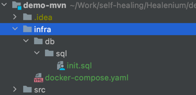

# healenium-backend
[](https://cdn0.iconfinder.com/data/icons/social-media-2104/24/social_media_social_media_logo_docker-128.png)
[](https://img.shields.io/docker/v/healenium/hlm-backend.svg?sort=date)

Healenium Backend of 2 docker containers: healenium-backend and healenium-db. Process healing results storage and processing 
https://hub.docker.com/repository/docker/healenium/hlm-backend

## How to start:

Download [Example of compose descriptor](https://github.com/healenium/healenium-client/blob/master/example/docker-compose.yaml) into your test project 
```
$ curl  https://raw.githubusercontent.com/healenium/healenium-client/master/example/docker-compose.yaml  -o docker-compose.yaml
```

Create /db/sql folder on the same level in your project. Add [init.sql file](https://github.com/healenium/healenium-client/blob/master/example/init.sql) into ./db/sql/init.sql folder in your project
```
$ curl https://raw.githubusercontent.com/healenium/healenium-client/master/example/init.sql -o init.sql
```
For example, you should have the project structure as below



To start hlm-backend and simply run docker-compose 
```
docker-compose up -d
```
Verify that hlm-backend:latest and postgres docker containers are up and running:
```
docker ps
```

### BACKEND AECHITECTURE DIAGRAM

